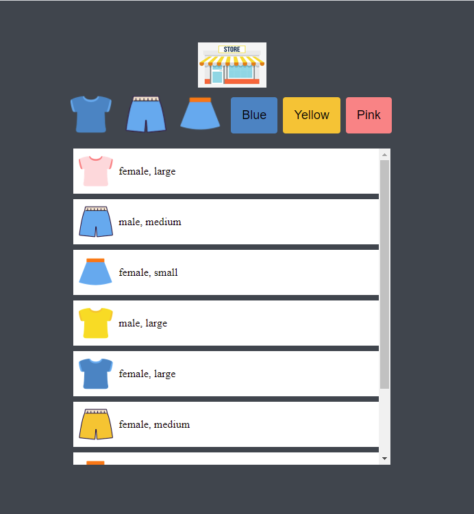
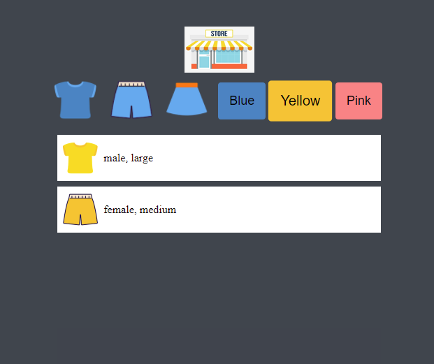
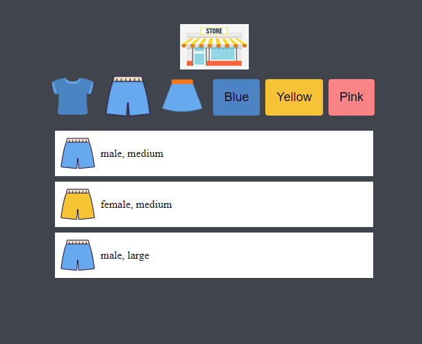

# minimi(PWA)

>PWA(Progressive Web App): ngrok, PWABuilder

>Filtering depending on type and color of the clothes

>Vanilla Javascript, CSS, Html

>Reference: 드림코딩 by 엘리 (쇼핑몰미니게임)

```
Main Features
1. Inner items scrolling bar
2. Retrieve json data
3. Filtering using buttons and display all data on home
4. CSS - used variables and animation
```







